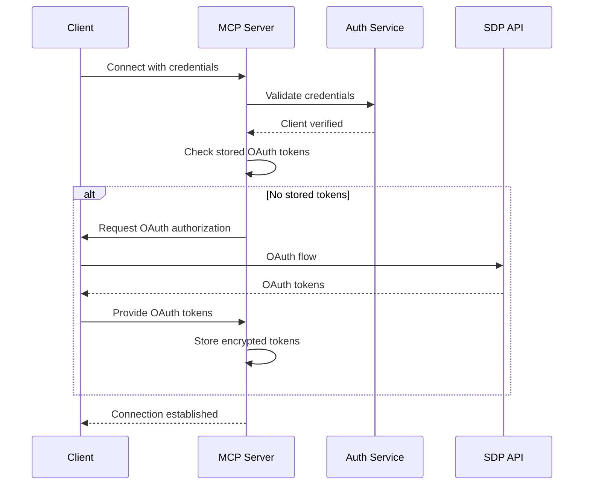

# MCP Client-Server Communication Patterns

*Last Updated: July 2025*

## Overview

This document details the communication patterns between MCP clients and servers, focusing on secure, scalable implementations for production environments.

## Transport Protocols

### 1. Server-Sent Events (SSE) - Recommended for Web

SSE provides a lightweight, HTTP-based solution for server-to-client streaming with automatic reconnection.

#### Implementation
```typescript
// Server-side SSE implementation
import { EventEmitter } from 'events';

class SSETransport {
  private clients = new Map<string, Response>();
  private eventEmitter = new EventEmitter();
  
  async handleConnection(req: Request, res: Response) {
    // Validate client authentication
    const clientId = await this.authenticateClient(req);
    
    // Set SSE headers
    res.writeHead(200, {
      'Content-Type': 'text/event-stream',
      'Cache-Control': 'no-cache',
      'Connection': 'keep-alive',
      'X-Accel-Buffering': 'no', // Disable Nginx buffering
    });
    
    // Store client connection
    this.clients.set(clientId, res);
    
    // Send initial connection event
    this.sendEvent(clientId, 'connected', { 
      clientId, 
      timestamp: new Date().toISOString() 
    });
    
    // Handle client disconnect
    req.on('close', () => {
      this.clients.delete(clientId);
      this.eventEmitter.emit('client:disconnected', clientId);
    });
    
    // Keep connection alive
    const keepAlive = setInterval(() => {
      res.write(':ping\n\n');
    }, 30000);
    
    req.on('close', () => clearInterval(keepAlive));
  }
  
  sendEvent(clientId: string, event: string, data: any) {
    const client = this.clients.get(clientId);
    if (!client) return;
    
    const message = [
      `event: ${event}`,
      `data: ${JSON.stringify(data)}`,
      `id: ${Date.now()}`,
      '', ''
    ].join('\n');
    
    client.write(message);
  }
  
  broadcast(event: string, data: any) {
    for (const [clientId, client] of this.clients) {
      this.sendEvent(clientId, event, data);
    }
  }
}
```

#### Client-side SSE
```typescript
class MCPSSEClient {
  private eventSource?: EventSource;
  private reconnectAttempts = 0;
  private maxReconnectAttempts = 5;
  
  async connect(serverUrl: string, token: string) {
    const url = new URL('/mcp/sse', serverUrl);
    
    this.eventSource = new EventSource(url.toString(), {
      headers: {
        'Authorization': `Bearer ${token}`,
      },
    });
    
    this.eventSource.addEventListener('message', (event) => {
      this.handleMessage(JSON.parse(event.data));
    });
    
    this.eventSource.addEventListener('error', (event) => {
      this.handleError(event);
    });
    
    this.eventSource.addEventListener('connected', (event) => {
      console.log('Connected to MCP server', event.data);
      this.reconnectAttempts = 0;
    });
  }
  
  private handleError(event: Event) {
    if (this.eventSource?.readyState === EventSource.CLOSED) {
      this.attemptReconnect();
    }
  }
  
  private async attemptReconnect() {
    if (this.reconnectAttempts >= this.maxReconnectAttempts) {
      console.error('Max reconnection attempts reached');
      return;
    }
    
    this.reconnectAttempts++;
    const delay = Math.min(1000 * Math.pow(2, this.reconnectAttempts), 30000);
    
    console.log(`Reconnecting in ${delay}ms...`);
    
    setTimeout(() => {
      this.connect(this.serverUrl, this.token);
    }, delay);
  }
}
```

### 2. WebSocket - For Bidirectional Communication

WebSocket provides full-duplex communication for real-time interactions.

#### Server Implementation
```typescript
import { WebSocketServer } from 'ws';
import { verify } from 'jsonwebtoken';

class MCPWebSocketServer {
  private wss: WebSocketServer;
  private clients = new Map<string, WebSocket>();
  
  constructor(server: HttpServer) {
    this.wss = new WebSocketServer({ 
      server,
      verifyClient: this.verifyClient.bind(this),
    });
    
    this.wss.on('connection', this.handleConnection.bind(this));
  }
  
  private async verifyClient(
    info: { origin: string; secure: boolean; req: IncomingMessage },
    callback: (result: boolean, code?: number, message?: string) => void
  ) {
    try {
      const token = this.extractToken(info.req);
      const payload = verify(token, process.env.JWT_SECRET!) as JWTPayload;
      
      // Store client info in request for later use
      (info.req as any).clientId = payload.clientId;
      
      callback(true);
    } catch (error) {
      callback(false, 401, 'Unauthorized');
    }
  }
  
  private handleConnection(ws: WebSocket, request: IncomingMessage) {
    const clientId = (request as any).clientId;
    
    // Store WebSocket connection
    this.clients.set(clientId, ws);
    
    // Send welcome message
    this.sendMessage(ws, {
      type: 'welcome',
      clientId,
      timestamp: new Date().toISOString(),
    });
    
    // Handle incoming messages
    ws.on('message', async (data) => {
      try {
        const message = JSON.parse(data.toString());
        await this.handleMessage(clientId, message);
      } catch (error) {
        this.sendError(ws, 'Invalid message format');
      }
    });
    
    // Handle pong for keepalive
    ws.on('pong', () => {
      (ws as any).isAlive = true;
    });
    
    // Handle disconnect
    ws.on('close', () => {
      this.clients.delete(clientId);
      console.log(`Client ${clientId} disconnected`);
    });
    
    // Start heartbeat
    this.startHeartbeat(ws);
  }
  
  private startHeartbeat(ws: WebSocket) {
    (ws as any).isAlive = true;
    
    const interval = setInterval(() => {
      if ((ws as any).isAlive === false) {
        ws.terminate();
        return;
      }
      
      (ws as any).isAlive = false;
      ws.ping();
    }, 30000);
    
    ws.on('close', () => clearInterval(interval));
  }
  
  private sendMessage(ws: WebSocket, message: any) {
    if (ws.readyState === WebSocket.OPEN) {
      ws.send(JSON.stringify(message));
    }
  }
  
  private async handleMessage(clientId: string, message: MCPMessage) {
    // Route message based on type
    switch (message.type) {
      case 'tool:execute':
        await this.handleToolExecution(clientId, message);
        break;
      
      case 'resource:fetch':
        await this.handleResourceFetch(clientId, message);
        break;
      
      default:
        this.sendError(
          this.clients.get(clientId)!, 
          `Unknown message type: ${message.type}`
        );
    }
  }
}
```

### 3. HTTP/REST - For Stateless Operations

Traditional REST API for simple request-response patterns.

#### Server Implementation
```typescript
import express from 'express';
import { authenticateToken } from './middleware/auth';

class MCPHTTPServer {
  private app: express.Application;
  
  constructor() {
    this.app = express();
    this.setupMiddleware();
    this.setupRoutes();
  }
  
  private setupMiddleware() {
    // Body parsing
    this.app.use(express.json({ limit: '10mb' }));
    
    // Authentication
    this.app.use(authenticateToken);
    
    // Request ID for tracing
    this.app.use((req, res, next) => {
      req.id = generateRequestId();
      res.setHeader('X-Request-ID', req.id);
      next();
    });
    
    // Logging
    this.app.use(this.logRequest.bind(this));
  }
  
  private setupRoutes() {
    // MCP endpoints
    this.app.post('/mcp/tools/:toolName/execute', this.executeToolHandler.bind(this));
    this.app.get('/mcp/resources/:resourceId', this.getResourceHandler.bind(this));
    this.app.post('/mcp/prompts/:promptId/run', this.runPromptHandler.bind(this));
    
    // Health check
    this.app.get('/health', (req, res) => {
      res.json({ status: 'healthy', timestamp: new Date().toISOString() });
    });
  }
  
  private async executeToolHandler(req: Request, res: Response) {
    const { toolName } = req.params;
    const { arguments: args } = req.body;
    
    try {
      // Validate tool exists
      const tool = this.toolRegistry.get(toolName);
      if (!tool) {
        return res.status(404).json({ 
          error: 'Tool not found',
          code: 'TOOL_NOT_FOUND' 
        });
      }
      
      // Validate arguments
      const validatedArgs = await tool.validateArguments(args);
      
      // Execute tool with timeout
      const result = await this.executeWithTimeout(
        () => tool.execute(validatedArgs, req.user),
        30000 // 30 second timeout
      );
      
      // Return result
      res.json({
        success: true,
        result,
        executedAt: new Date().toISOString(),
      });
      
    } catch (error) {
      this.handleError(error, res);
    }
  }
}
```

## Message Protocol

### JSON-RPC 2.0 Format

All MCP messages follow the JSON-RPC 2.0 specification:

```typescript
interface JSONRPCRequest {
  jsonrpc: '2.0';
  id: string | number;
  method: string;
  params?: any;
}

interface JSONRPCResponse {
  jsonrpc: '2.0';
  id: string | number;
  result?: any;
  error?: {
    code: number;
    message: string;
    data?: any;
  };
}
```

### MCP-Specific Messages

#### Tool Execution Request
```json
{
  "jsonrpc": "2.0",
  "id": "1234",
  "method": "tools/call",
  "params": {
    "name": "create_request",
    "arguments": {
      "subject": "New laptop request",
      "description": "Need a new laptop for development",
      "requester_email": "user@example.com",
      "priority": "medium"
    }
  }
}
```

#### Tool Execution Response
```json
{
  "jsonrpc": "2.0",
  "id": "1234",
  "result": {
    "content": [
      {
        "type": "text",
        "text": "Created request #12345: New laptop request"
      }
    ]
  }
}
```

#### Error Response
```json
{
  "jsonrpc": "2.0",
  "id": "1234",
  "error": {
    "code": -32602,
    "message": "Invalid params",
    "data": {
      "field": "requester_email",
      "error": "Invalid email format"
    }
  }
}
```

## Authentication Patterns

### 1. Initial Authentication



### 2. Token Refresh Flow

```typescript
class TokenRefreshManager {
  private refreshQueue = new Map<string, Promise<OAuthTokens>>();
  
  async ensureValidToken(clientId: string): Promise<string> {
    const token = await this.tokenStore.getToken(clientId);
    
    if (!token) {
      throw new Error('No token available for client');
    }
    
    // Check if token needs refresh (5 minute buffer)
    const expiresAt = new Date(token.expiresAt);
    const refreshAt = new Date(expiresAt.getTime() - 5 * 60 * 1000);
    
    if (new Date() >= refreshAt) {
      // Check if refresh is already in progress
      let refreshPromise = this.refreshQueue.get(clientId);
      
      if (!refreshPromise) {
        // Start new refresh
        refreshPromise = this.refreshToken(clientId, token);
        this.refreshQueue.set(clientId, refreshPromise);
        
        // Clean up after completion
        refreshPromise.finally(() => {
          this.refreshQueue.delete(clientId);
        });
      }
      
      const newToken = await refreshPromise;
      return newToken.accessToken;
    }
    
    return token.accessToken;
  }
  
  private async refreshToken(
    clientId: string, 
    currentToken: OAuthToken
  ): Promise<OAuthTokens> {
    try {
      const newTokens = await this.sdpClient.refreshOAuthToken(
        currentToken.refreshToken
      );
      
      await this.tokenStore.storeToken(clientId, newTokens);
      
      return newTokens;
    } catch (error) {
      // Log refresh failure
      this.logger.error('Token refresh failed', { clientId, error });
      throw error;
    }
  }
}
```

## Connection Management

### 1. Connection Pooling

```typescript
class ConnectionPool {
  private connections = new Map<string, ClientConnection>();
  private maxConnectionsPerClient = 5;
  
  async getConnection(clientId: string): Promise<ClientConnection> {
    const clientConnections = this.getClientConnections(clientId);
    
    // Find available connection
    const available = clientConnections.find(conn => !conn.isActive);
    if (available) {
      available.isActive = true;
      return available;
    }
    
    // Create new connection if under limit
    if (clientConnections.length < this.maxConnectionsPerClient) {
      const newConnection = await this.createConnection(clientId);
      this.addConnection(clientId, newConnection);
      return newConnection;
    }
    
    // Wait for available connection
    return this.waitForConnection(clientId);
  }
  
  releaseConnection(connection: ClientConnection) {
    connection.isActive = false;
    connection.lastUsed = new Date();
  }
  
  // Clean up idle connections
  startCleanupTask() {
    setInterval(() => {
      const idleTimeout = 5 * 60 * 1000; // 5 minutes
      const now = new Date();
      
      for (const [clientId, connections] of this.connections) {
        const active = connections.filter(conn => {
          if (!conn.isActive && 
              now.getTime() - conn.lastUsed.getTime() > idleTimeout) {
            conn.close();
            return false;
          }
          return true;
        });
        
        if (active.length === 0) {
          this.connections.delete(clientId);
        } else {
          this.connections.set(clientId, active);
        }
      }
    }, 60000); // Run every minute
  }
}
```

### 2. Reconnection Strategy

```typescript
class ReconnectionManager {
  private reconnectAttempts = new Map<string, number>();
  private maxAttempts = 5;
  private baseDelay = 1000;
  private maxDelay = 30000;
  
  async handleDisconnection(clientId: string, connection: Connection) {
    const attempts = this.reconnectAttempts.get(clientId) || 0;
    
    if (attempts >= this.maxAttempts) {
      this.logger.error('Max reconnection attempts reached', { clientId });
      this.notifyClient(clientId, 'connection_failed');
      return;
    }
    
    const delay = this.calculateDelay(attempts);
    this.reconnectAttempts.set(clientId, attempts + 1);
    
    this.logger.info('Scheduling reconnection', { 
      clientId, 
      attempt: attempts + 1, 
      delay 
    });
    
    setTimeout(async () => {
      try {
        await connection.reconnect();
        this.reconnectAttempts.delete(clientId);
        this.notifyClient(clientId, 'connection_restored');
      } catch (error) {
        this.handleDisconnection(clientId, connection);
      }
    }, delay);
  }
  
  private calculateDelay(attempt: number): number {
    // Exponential backoff with jitter
    const exponentialDelay = Math.min(
      this.baseDelay * Math.pow(2, attempt),
      this.maxDelay
    );
    
    // Add jitter (±25%)
    const jitter = exponentialDelay * 0.25;
    return exponentialDelay + (Math.random() * 2 - 1) * jitter;
  }
}
```

## Message Queue Integration

### 1. Asynchronous Processing

```typescript
import { Queue, Worker } from 'bullmq';

class MCPMessageQueue {
  private toolQueue: Queue;
  private resultQueue: Queue;
  
  constructor(redis: Redis) {
    this.toolQueue = new Queue('mcp:tools', {
      connection: redis,
      defaultJobOptions: {
        attempts: 3,
        backoff: {
          type: 'exponential',
          delay: 2000,
        },
        removeOnComplete: true,
        removeOnFail: false,
      },
    });
    
    this.resultQueue = new Queue('mcp:results', {
      connection: redis,
    });
    
    this.setupWorkers();
  }
  
  async queueToolExecution(
    clientId: string, 
    toolName: string, 
    args: any
  ): Promise<string> {
    const job = await this.toolQueue.add(toolName, {
      clientId,
      toolName,
      args,
      timestamp: new Date().toISOString(),
    }, {
      priority: this.getToolPriority(toolName),
    });
    
    return job.id!;
  }
  
  private setupWorkers() {
    new Worker('mcp:tools', async (job) => {
      const { clientId, toolName, args } = job.data;
      
      try {
        // Get valid token
        const token = await this.tokenManager.ensureValidToken(clientId);
        
        // Execute tool
        const result = await this.toolExecutor.execute(
          toolName, 
          args, 
          token
        );
        
        // Queue result for delivery
        await this.resultQueue.add('deliver', {
          clientId,
          jobId: job.id,
          result,
          completedAt: new Date().toISOString(),
        });
        
        return result;
      } catch (error) {
        this.logger.error('Tool execution failed', {
          jobId: job.id,
          toolName,
          error,
        });
        throw error;
      }
    }, {
      connection: this.redis,
      concurrency: 10,
    });
  }
}
```

## Protocol Extensions

### 1. Streaming Responses

For large data transfers or real-time updates:

```typescript
interface StreamingResponse {
  jsonrpc: '2.0';
  id: string | number;
  result: {
    stream: true;
    chunks: number;
    chunkId: number;
    data: any;
    complete?: boolean;
  };
}

class StreamingHandler {
  async streamLargeResult(
    clientId: string, 
    requestId: string, 
    data: AsyncIterable<any>
  ) {
    let chunkId = 0;
    
    for await (const chunk of data) {
      const response: StreamingResponse = {
        jsonrpc: '2.0',
        id: requestId,
        result: {
          stream: true,
          chunks: -1, // Unknown total
          chunkId: chunkId++,
          data: chunk,
          complete: false,
        },
      };
      
      await this.sendToClient(clientId, response);
    }
    
    // Send completion marker
    await this.sendToClient(clientId, {
      jsonrpc: '2.0',
      id: requestId,
      result: {
        stream: true,
        chunks: chunkId,
        chunkId,
        data: null,
        complete: true,
      },
    });
  }
}
```

### 2. Batch Operations

```typescript
interface BatchRequest {
  jsonrpc: '2.0';
  id: string;
  method: 'batch';
  params: {
    requests: JSONRPCRequest[];
    parallel?: boolean;
  };
}

class BatchHandler {
  async handleBatch(batch: BatchRequest, clientId: string) {
    const { requests, parallel = false } = batch.params;
    
    if (parallel) {
      // Execute in parallel with concurrency limit
      const results = await pMap(
        requests,
        (request) => this.executeRequest(request, clientId),
        { concurrency: 5 }
      );
      
      return {
        jsonrpc: '2.0',
        id: batch.id,
        result: results,
      };
    } else {
      // Execute sequentially
      const results = [];
      
      for (const request of requests) {
        const result = await this.executeRequest(request, clientId);
        results.push(result);
      }
      
      return {
        jsonrpc: '2.0',
        id: batch.id,
        result: results,
      };
    }
  }
}
```

## Performance Optimization

### 1. Response Caching

```typescript
class ResponseCache {
  private cache = new LRUCache<string, CachedResponse>({
    max: 1000,
    ttl: 5 * 60 * 1000, // 5 minutes
  });
  
  async getCachedOrExecute<T>(
    key: string,
    executor: () => Promise<T>,
    options?: CacheOptions
  ): Promise<T> {
    // Check cache
    const cached = this.cache.get(key);
    if (cached && !this.isStale(cached, options)) {
      return cached.data as T;
    }
    
    // Execute and cache
    const result = await executor();
    
    this.cache.set(key, {
      data: result,
      timestamp: new Date(),
      etag: this.generateETag(result),
    });
    
    return result;
  }
  
  private isStale(cached: CachedResponse, options?: CacheOptions): boolean {
    if (options?.forceRefresh) return true;
    
    const age = Date.now() - cached.timestamp.getTime();
    const maxAge = options?.maxAge || 5 * 60 * 1000;
    
    return age > maxAge;
  }
}
```

### 2. Request Deduplication

```typescript
class RequestDeduplicator {
  private inFlight = new Map<string, Promise<any>>();
  
  async deduplicate<T>(
    key: string,
    executor: () => Promise<T>
  ): Promise<T> {
    // Check if identical request is in flight
    const existing = this.inFlight.get(key);
    if (existing) {
      return existing;
    }
    
    // Execute and store promise
    const promise = executor().finally(() => {
      // Clean up after completion
      this.inFlight.delete(key);
    });
    
    this.inFlight.set(key, promise);
    return promise;
  }
  
  generateKey(method: string, params: any): string {
    return `${method}:${hash(params)}`;
  }
}
```

## Error Handling & Recovery

### 1. Graceful Degradation

```typescript
class GracefulDegradation {
  async executeWithFallback<T>(
    primary: () => Promise<T>,
    fallback: () => Promise<T>,
    context: string
  ): Promise<T> {
    try {
      return await primary();
    } catch (error) {
      this.logger.warn(`Primary execution failed for ${context}`, { error });
      
      try {
        return await fallback();
      } catch (fallbackError) {
        this.logger.error(`Fallback also failed for ${context}`, { 
          primaryError: error,
          fallbackError 
        });
        
        throw new Error(`Both primary and fallback failed for ${context}`);
      }
    }
  }
}
```

### 2. Circuit Breaker per Client

```typescript
class ClientCircuitBreaker {
  private breakers = new Map<string, CircuitBreaker>();
  
  getBreaker(clientId: string): CircuitBreaker {
    let breaker = this.breakers.get(clientId);
    
    if (!breaker) {
      breaker = new CircuitBreaker({
        threshold: 5,
        timeout: 60000,
        resetTimeout: 30000,
        onOpen: () => {
          this.logger.warn(`Circuit breaker opened for client ${clientId}`);
          this.notifyClient(clientId, 'service_degraded');
        },
        onClose: () => {
          this.logger.info(`Circuit breaker closed for client ${clientId}`);
          this.notifyClient(clientId, 'service_restored');
        },
      });
      
      this.breakers.set(clientId, breaker);
    }
    
    return breaker;
  }
  
  async executeWithBreaker<T>(
    clientId: string,
    operation: () => Promise<T>
  ): Promise<T> {
    const breaker = this.getBreaker(clientId);
    return breaker.execute(operation);
  }
}
```

## Monitoring & Observability

### 1. Request Tracing

```typescript
interface TraceContext {
  traceId: string;
  spanId: string;
  parentSpanId?: string;
  flags: number;
}

class RequestTracer {
  startTrace(request: MCPRequest): TraceContext {
    const context: TraceContext = {
      traceId: request.traceId || generateTraceId(),
      spanId: generateSpanId(),
      flags: 1, // Sampled
    };
    
    // Set context in async local storage
    this.asyncLocalStorage.run(context, () => {
      this.logger.info('Request started', {
        traceId: context.traceId,
        spanId: context.spanId,
        method: request.method,
        clientId: request.clientId,
      });
    });
    
    return context;
  }
  
  createChildSpan(name: string): TraceContext {
    const parent = this.asyncLocalStorage.getStore();
    
    return {
      traceId: parent!.traceId,
      spanId: generateSpanId(),
      parentSpanId: parent!.spanId,
      flags: parent!.flags,
    };
  }
}
```

### 2. Metrics Collection

```typescript
class CommunicationMetrics {
  private metrics = {
    requestsTotal: new Counter({
      name: 'mcp_requests_total',
      help: 'Total number of MCP requests',
      labelNames: ['method', 'status', 'client_id'],
    }),
    
    requestDuration: new Histogram({
      name: 'mcp_request_duration_seconds',
      help: 'MCP request duration in seconds',
      labelNames: ['method', 'status'],
      buckets: [0.1, 0.5, 1, 2, 5, 10],
    }),
    
    activeConnections: new Gauge({
      name: 'mcp_active_connections',
      help: 'Number of active MCP connections',
      labelNames: ['transport'],
    }),
    
    messageQueueSize: new Gauge({
      name: 'mcp_message_queue_size',
      help: 'Number of messages in queue',
      labelNames: ['queue_name'],
    }),
  };
  
  recordRequest(method: string, status: string, duration: number, clientId: string) {
    this.metrics.requestsTotal.inc({ method, status, client_id: clientId });
    this.metrics.requestDuration.observe({ method, status }, duration);
  }
  
  updateConnections(transport: string, count: number) {
    this.metrics.activeConnections.set({ transport }, count);
  }
}
```

## Security Considerations

### 1. Message Validation

```typescript
class MessageValidator {
  private schemas = new Map<string, z.ZodSchema>();
  
  constructor() {
    // Register known message schemas
    this.schemas.set('tools/call', z.object({
      jsonrpc: z.literal('2.0'),
      id: z.union([z.string(), z.number()]),
      method: z.literal('tools/call'),
      params: z.object({
        name: z.string(),
        arguments: z.record(z.any()),
      }),
    }));
  }
  
  validate(message: any): ValidatedMessage {
    // Basic JSON-RPC validation
    const baseSchema = z.object({
      jsonrpc: z.literal('2.0'),
      id: z.union([z.string(), z.number()]),
      method: z.string(),
    });
    
    const base = baseSchema.parse(message);
    
    // Method-specific validation
    const schema = this.schemas.get(base.method);
    if (!schema) {
      throw new ValidationError(`Unknown method: ${base.method}`);
    }
    
    return schema.parse(message);
  }
}
```

### 2. Rate Limiting per Method

```typescript
class MethodRateLimiter {
  private limits: Map<string, RateLimitConfig> = new Map([
    ['tools/call', { points: 10, duration: 60 }],
    ['resources/fetch', { points: 50, duration: 60 }],
    ['prompts/run', { points: 5, duration: 60 }],
  ]);
  
  async checkLimit(clientId: string, method: string): Promise<void> {
    const config = this.limits.get(method) || 
                   { points: 20, duration: 60 }; // Default
    
    const key = `${clientId}:${method}`;
    
    const limiter = new RateLimiterRedis({
      storeClient: this.redis,
      keyPrefix: 'rl:method',
      ...config,
    });
    
    try {
      await limiter.consume(key);
    } catch (rejRes) {
      throw new RateLimitError(
        `Rate limit exceeded for ${method}`,
        Math.round(rejRes.msBeforeNext / 1000)
      );
    }
  }
}
```

## Testing Strategies

### 1. Connection Testing

```typescript
describe('MCP Connection Tests', () => {
  let server: MCPServer;
  let client: MCPClient;
  
  beforeEach(async () => {
    server = await createTestServer();
    client = new MCPClient(server.url);
  });
  
  describe('Connection Lifecycle', () => {
    it('should establish connection with valid credentials', async () => {
      const connected = await client.connect({
        clientId: 'test-client',
        clientSecret: 'test-secret',
      });
      
      expect(connected).toBe(true);
      expect(client.isConnected()).toBe(true);
    });
    
    it('should handle connection loss and reconnection', async () => {
      await client.connect(validCredentials);
      
      // Simulate connection loss
      server.disconnect(client.id);
      
      await waitFor(() => expect(client.isConnected()).toBe(false));
      
      // Should auto-reconnect
      await waitFor(() => expect(client.isConnected()).toBe(true), {
        timeout: 10000,
      });
    });
    
    it('should respect rate limits', async () => {
      await client.connect(validCredentials);
      
      // Exceed rate limit
      const promises = Array(15).fill(0).map(() => 
        client.callTool('test-tool', {})
      );
      
      await expect(Promise.all(promises)).rejects.toThrow(RateLimitError);
    });
  });
});
```

### 2. Protocol Testing

```typescript
describe('MCP Protocol Tests', () => {
  it('should handle malformed messages gracefully', async () => {
    const response = await sendRawMessage(server, {
      // Missing jsonrpc version
      id: '123',
      method: 'tools/call',
    });
    
    expect(response.error).toEqual({
      code: -32600,
      message: 'Invalid Request',
    });
  });
  
  it('should process batch requests correctly', async () => {
    const batchResponse = await client.sendBatch([
      { method: 'tools/list', params: {} },
      { method: 'resources/list', params: {} },
    ]);
    
    expect(batchResponse).toHaveLength(2);
    expect(batchResponse[0].result).toBeDefined();
    expect(batchResponse[1].result).toBeDefined();
  });
});
```

## References

- [MCP Specification](https://modelcontextprotocol.io/specification)
- [JSON-RPC 2.0 Specification](https://www.jsonrpc.org/specification)
- [WebSocket Protocol RFC 6455](https://tools.ietf.org/html/rfc6455)
- [Server-Sent Events W3C](https://www.w3.org/TR/eventsource/)
- [HTTP/2 Server Push](https://tools.ietf.org/html/rfc7540#section-8.2)